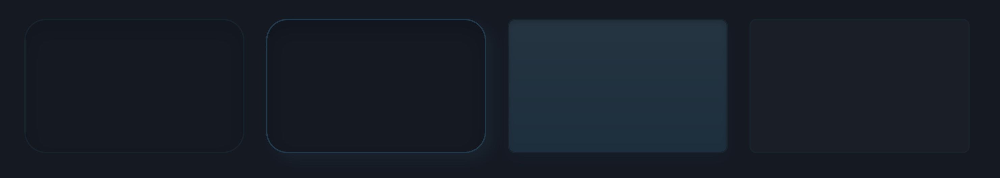
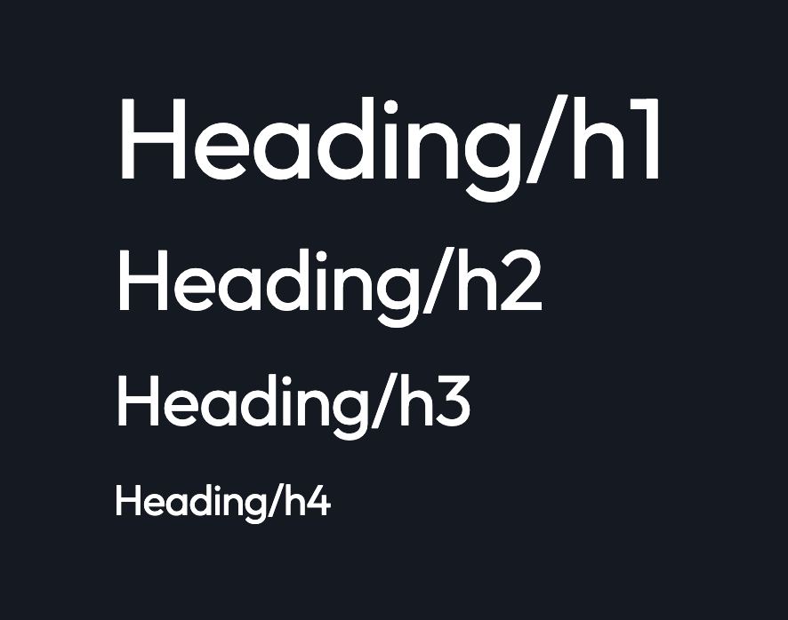
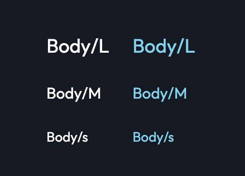
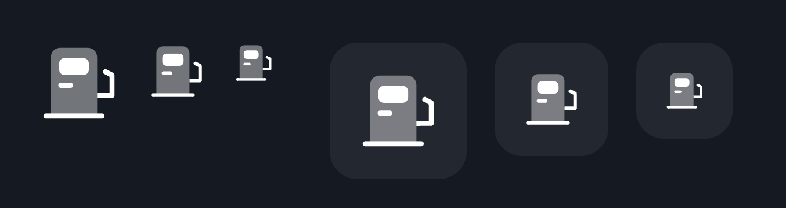
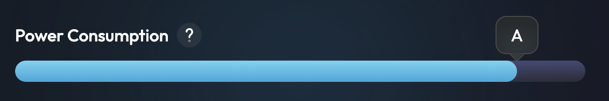

# Blockmetrics frontend

## Table of Contents

- [Introduction](#introduction)
- [Technologies](#technologies)
- [Style](#style)

## Introduction

## Technologies

Project is created with:

## Style

### Theme

- [Components](#components)
- [Layouts](#layouts)
- [Global props](#global-props)
- [Enumerations](#Enumerations)

### Components

- [BMButton](#bmbutton)
- [BMBlockPattern](#bmblockpattern)
- [BMHivePattern](#bmhivepattern)
- [BMCardContainer](#bmcardcontainer)
- [BMLink](#BMLink)
- [BMGradientSeparator](#bmgradientseparator)
- [BMHeading](#bmheading)
- [BMText](#bmtext)
- [BMIcon](#bmicon)
- [BMListItem](#bmlistitem)
- [BMProgressBar](#bmprogressbar)
- [BMSkeleton](#bmskeleton)

#### BMButton

##### Props

| Name      | Type                      | Default  | Description                                                                                                     |
|-----------|:--------------------------|:---------|:----------------------------------------------------------------------------------------------------------------|
| children  | React.ReactNode, string   | null     | label                                                                                                           |
| onClick   | void                      | () => {} | function called when user click on the button                                                                   |
| secondary | boolean                   | false    | if true background partially transparent                                                                        |
| disabled  | boolean                   | false    | deactivate button                                                                                               |
| fullWidth | boolean                   | false    | set width to 100%                                                                                               |
| ariaLabel | string                    | null     | Add custom aria label if children is not string, by default children will be set as aria label if it's a string |
| size      | ESize.s, ESize.m, ESize.l | ESize.m  | Size of the button                                                                                              |

---

#### BMBlockPattern

##### Props

| Name | Type  | Default | Description         |
|------|:------|:--------|:--------------------|
| size | ESize | ESize.l | Size of the pattern |

---
#### BMHivePattern

##### Props

| Name | Type  | Default | Description         |
|------|:------|:--------|:--------------------|
| size | ESize | ESize.l | Size of the pattern |
---

#### BMCardContainer

##### props

| Name          | Type            | Default   | Description                              |
|---------------|:----------------|:----------|:-----------------------------------------|
| children      | React.ReactNode | null      | null                                     |
| isHighlighted | boolean         | false     | highlighted borders                      |
| secondary     | boolean         | false     | Display secondary style                  |
| tertiary      | boolean         | false     | Display tertiary style                   |
| fullWidth     | boolean         | false     | Set width to 100%                        |
| fullHeight    | boolean         | false     | set height to 100%                       |
| clickable     | boolean         | false     | display a glow effect on container hover |
| borderRadius  | ESize           | ESize.m   | set the border radius of the card        |
| as            | string          | undefined | change the html tag of the component     |
| id            | string          | undefined | set the id of the component              |

> The props extends [IPadding](#ipadding), [IMargin](#imargin) and [ISkeleton](#iskeleton)
---

#### BMLink

##### props
| Name          | Type            | Default            | Description                                        |
|---------------|:----------------|:-------------------|:---------------------------------------------------|
| children      | React.ReactNode | null               | null                                               |
| href          | string          | null               | link target                                        |
| size          | ESize           | ESize.l            | size of the text                                   |
| inheritStyles | boolean         | false              | inherit style from parent                          |
| weight        | ETextWeight     | ETextWeight.normal | weight of the font                                 |
| textColor     | ETextColor      | ETextColor.accent  | text color                                         |
| isInteral     | boolean         | false              | the target will be the same (not _blank, rel, etc) |
| ariaLabel     | string          | undefined          | set custom aria label                              |

> The props extends [ISkeleton](#iskeleton)
#### NGGradientSeparator

---

#### props

| Name      | Type                                       | Default               | Description                                                         |
|-----------|:-------------------------------------------|-----------------------|---------------------------------------------------------------------|
| direction | EDirection.vertical, EDirection.horizontal | EDirection.horizontal | set separator direction                                             |
| margin    | ESize                                      | undefined             | set the vertical margin or horizontal margin depending on direction |
| smMargin  | ESize                                      | undefined             | margin for sm and smaller                                           |
| smMargin  | ESize                                      | undefined             | margin for sm and smaller                                           |
| mdMargin  | ESize                                      | undefined             | margin for md and smaller                                           |
| lgMargin  | ESize                                      | undefined             | margin for lg and smaller                                           |
| xlMargin  | ESize                                      | undefined             | margin for xl and smaller                                           |

---

#### BMHeading

##### props

| Name       | Type                                                   | Default            | Description          |
|------------|:-------------------------------------------------------|--------------------|----------------------|
| children   | React.ReactNode, string                                | null               | label                |
| singleLine | boolean                                                | true               | set line-height to 1 |
| textColor  | ETextColor                                             | ETextColor.default | change text color    |
| textAlign  | ETextAlign                                             | ETextAlign.left    | Set text alignement  |
| type       | ETextType.h1, ETextType.h2, ETextType.h3, ETextType.h4 | null               | Set heading tag      |
| fontWeight | EFontWeight                                            | null               | custom text weight   |

> The props extends [IPadding](#ipadding), [IMargin](#imargin) and [ISkeleton](#iskeleton)

---

#### BMText

##### props

| Name         | Type                        | Default             | Description                          |
|--------------|:----------------------------|---------------------|--------------------------------------|
| children     | React.ReactNode, string     | null                | label                                |
| singleLine   | boolean                     | false               | set line-height to 1                 |
| inheritStyle | boolean                     | true                | inherit style from parent (for span) |
| textColor    | ETextColor                  | default             | update text color                    |
| fontWeight   | EFontWeight                 | EFontWeight.regular | Custom font weight                   |
| textAlign    | ETextAlign                  | ETextAlign.left     | Set text alignement                  |
| type         | ETextType.p, ETextType.span | ETextType.p         | Set text tag                         |

> The props extends [IPadding](#ipadding), [IMargin](#imargin) and [ISkeleton](#iskeleton)

---

#### BMIcon

| Name              | Type                                | Default | Description                        |
|-------------------|:------------------------------------|---------|------------------------------------|
| type              | EIcon                               | null    | set icon used                      |
| size              | ESize.s, ESize.m, ESize.l, ESize.xl | ESize.l | set the size of the icon           |
| backgroundVisible | boolean                             | false   | display le background with borders |
| backgroundRadius  | ESize                               | ESize.s | border radius of the background    |
| isVisible         | boolean                             | true    | Show/Hide the icon                 |

> The props extends [IPadding](#ipadding), [IMargin](#imargin) and [ISkeleton](#iskeleton)

---

#### BMListItem

##### Props

| Name      | Type                    | Default   | Description           |
|-----------|:------------------------|:----------|:----------------------|
| children  | React.ReactNode, string | undefined | the list item content |
| dotHidden | boolean                 | false     | hide the blue dot     |
---

#### BMProgressBar

##### Props

| Name            | Type    | Default   | Description                                               |
|-----------------|:--------|:----------|:----------------------------------------------------------|
| label           | string  | undefined | the label on top of the bar                               |
| helpText        | string  | undefined | The text on a (?) tooltip                                 |
| size            | ESize   | ESize.s   | the size of the progress bar                              |
| value           | number  | 0         | the actual value to display                               |
| endValueVisible | boolean | false     | display the end value in a box on top of the progress bar |
| endValue        | string  | undefined | the value to display in the box                           |

--- 
#### BMSkeleton

##### props

| Name   | Type                  | Default | Description                                 |
|--------|:----------------------|---------|---------------------------------------------|
| width  | ESize, number, string | 60      | set skeleton width                          |
| height | ESize, number, string | ESize.s | set skeleton height                         |
| circle | boolean               | false   | set height with the same value as the width |

> The props extends [IPadding](#ipadding) and [IMargin](#imargin)

---

### Layouts

- [Flex](#flex)
- [Spacing](#spacing)
- [Main](#main)
- [Column](#column)

#### Flex

#### props

| Name                                                  | Type                                                              | Default     | Description                  |
| ----------------------------------------------------- | ----------------------------------------------------------------- | ----------- | :--------------------------- |
| children                                              | React.ReactNode                                                   | null        | Children                     |
| fullWidth                                             | boolean                                                           | false       | Set container width to 100%. |
| fullHeight                                            | boolean                                                           | false       | Set container height to 100% |
| wrapItems                                             | boolean                                                           | false       | activate flex wrap           |
| direction                                             | EFlex.row, EFlex.rowReverse, EFlex.column, Flex.columnReverse     | EFlex.row   | Flex direction               |
| horizontal                                            | EFlex.start, EFlex.end, EFlex.between, EFlex.around, EFlex.center | EFlex.start | justify-content              |
| vertical                                              | EFlex.start, EFlex.end, EFlex.between, EFlex.around, Elex.center  | EFlex.start | align-items                  |
| smDirection, mdDirection, lgDirection, xlDirection    | EFlex.row, EFlex.rowReverse, EFlex.column, Flex.columnReverse     | null        | Responsive flex-direction    |
| smHorizontal, mdHorizontal, gHorizontal, xlHorizontal | EFlex.start, EFlex.end, EFlex.between, EFlex.around, EFlex.center | null        | Responsive justify-content   |
| smVertical, mdVertical, lgVertical, xlVertical        | EFlex.start, EFlex.end, EFlex.between, EFlex.around, EFlex.center | null        | Responsive align-items       |

> The props extends [Padding](#padding) and [Margin](#margin)

---

#### Spacing

##### props

| Name        | Type       | Default        | Description                                                       |
| ----------- | :--------- | -------------- | ----------------------------------------------------------------- |
| size        | ESize      | ESize.l        | Size of the space                                                 |
| smSize      | ESize      | null           | Responsive size of the margin (smaller to sm)                     |
| mdSize      | ESize      | null           | Responsive size of the margin (smaller to md)                     |
| lgSize      | ESize      | null           | Responsive size of the margin (smaller to lg)                     |
| xlSize      | ESize      | null           | Responsive size of the margin (smaller to xl)                     |
| xsDirection | EDirection | EDirection.all | space horizontal, space vertical or space horizontal and vertical |
| smDirection | EDirection | null           | space horizontal, space vertical or space horizontal and vertical |
| mdDirection | EDirection | null           | space horizontal, space vertical or space horizontal and vertical |
| lgDirection | EDirection | null           | space horizontal, space vertical or space horizontal and vertical |
| xlDirection | EDirection | null           | space horizontal, space vertical or space horizontal and vertical |

---

#### Main

Main container with margin and padding to prevent overflow behind the navbar

---

#### Column

#### props

| Name     | Type                | Default | Description                               |
| -------- | ------------------- | ------- | :---------------------------------------- |
| children | React.ReactNode     | null    | Children                                  |
| columns  | number from 0 to 12 | 12      | width by default including bigger than xl |
| sm       | number from 0 to 12 | null    | width for smaller than sm                 |
| md       | number from 0 to 12 | null    | width for smaller than md                 |
| lg       | number from 0 to 12 | null    | width for smaller than lg                 |
| xl       | number from 0 to 12 | null    | width for smaller than xl                 |

> The props extends [IPadding](#ipadding) and [IMargin](#imargin)

---

### Global props

- [IPadding](#ipadding)
- [Margin](#margin)
- [ISkeleton](#iskeleton)

#### IPadding

#### props

| Name                                                               | Type  | Default | Description         |
| ------------------------------------------------------------------ | ----- | ------- | :------------------ |
| padding                                                            | ESize | null    | set padding X and Y |
| paddingX                                                           | ESize | null    | set padding X       |
| paddingY                                                           | ESize | null    | set padding Y       |
| paddingBottom                                                      | ESize | null    | set padding bottom  |
| paddingTop                                                         | ESize | null    | set padding top     |
| paddingLeft                                                        | ESize | null    | set padding left    |
| paddingRight                                                       | ESize | null    | set padding right   |
| smPadding, mdPadding, lgPadding, xlPadding                         | ESize | null    | Responsive padding  |
| smPaddingX, mdPaddingX, lgPaddingX, xlPaddingX                     | ESize | null    | Responsive padding  |
| smPaddYing, mdPaddiYng, lgPaddinYg, xlPaddingY                     | ESize | null    | Responsive padding  |
| smPaddingBottom, mdPaddingBottom, lgPaddingBottom, xlPaddingBottom | ESize | null    | Responsive padding  |
| smPaddingTop, mdPaddingTop, lgPaddingTop, xlPaddingTop             | ESize | null    | Responsive padding  |
| smPaddingLeft, mdPaddingLeft, lgPaddingLeft, xlPaddingLeft         | ESize | null    | Responsive padding  |
| smPaddingRight, mdPaddingRight, lgPaddingRight, xlPaddingRight     | ESize | null    | Responsive padding  |

---

#### IMargin

#### props

| Name                                                           | Type  | Default | Description        |
| -------------------------------------------------------------- | ----- | ------- | :----------------- |
| padding                                                        | ESize | null    | set margin X and Y |
| marginX                                                        | ESize | null    | set margin X       |
| marginY                                                        | ESize | null    | set margin Y       |
| marginBottom                                                   | ESize | null    | set margin bottom  |
| marginTop                                                      | ESize | null    | set margin top     |
| marginLeft                                                     | ESize | null    | set margin left    |
| marginRight                                                    | ESize | null    | set margin right   |
| smMargin, mdMargin, lgMargin, xlMargin                         | ESize | null    | Responsive margin  |
| smMarginX, mdMarginX, lgMarginX, xlMarginX                     | ESize | null    | Responsive margin  |
| smPaddYing, mdPaddiYng, lgPaddinYg, xlMarginY                  | ESize | null    | Responsive margin  |
| smMarginBottom, mdMarginBottom, lgMarginBottom, xlMarginBottom | ESize | null    | Responsive margin  |
| smMarginTop, mdMarginTop, lgMarginTop, xlMarginTop             | ESize | null    | Responsive margin  |
| smMarginLeft, mdMarginLeft, lgMarginLeft, xlMarginLeft         | ESize | null    | Responsive margin  |
| smMarginRight, mdMarginRight, lgMarginRight, xlMarginRight     | ESize | null    | Responsive margin  |

---

#### ISkeleton

#### props

| Name            | Type                  | Default | Description                                 |
| --------------- | --------------------- | ------- | :------------------------------------------ |
| loading         | boolean               | null    | set margin X and Y                          |
| loaderLineCount | ESize                 | null    | set margin X                                |
| skWidth         | ESize, number, string | 60      | set skeleton width                          |
| skHeight        | ESize, number, string | ESize.s | set skeleton height                         |
| circle          | boolean               | null    | set height with the same value as the width |

---

### Enumerations

You can find the enumerations in the [enum.ts](./styles/utils/enum.ts) file